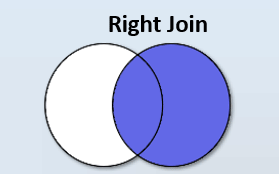

# Right Join

```info
Author      Ter-Petrosyan Hakob
```

---

The right join is the twin of the left join, so we would have the same result if we wrote `table A` left join `table B` , 
or `table B` right join `table A` . For example, we can obtain the same results if we write:


```sql
select c.id   AS category_id,
       c.name AS category_name,
       g.id   AS good_id,
       g.name AS good_name
from categories c
         left join goods g on g.category_id = c.id;

 category_id | category_name | good_id |    good_name    
-------------+---------------+---------+-----------------
           1 | Electronics   |       1 | Smartphone
           3 | Laptops       |       2 | Gaming Laptop
           3 | Laptops       |       3 | Business Laptop
           2 | Computers     |       4 | Desktop PC
           5 | Kitchen       |       5 | Refrigerator
           5 | Kitchen       |       6 | Blender
           5 | Kitchen       |       7 | Microwave
           4 | Home          |  <null> | <null>
(8 rows)
```

or if we write:

```sql
select c.id   AS category_id,
       c.name AS category_name,
       g.id   AS good_id,
       g.name AS good_name
from goods g
         right join categories c on c.id = g.category_id;

 category_id | category_name | good_id |    good_name    
-------------+---------------+---------+-----------------
           1 | Electronics   |       1 | Smartphone
           3 | Laptops       |       2 | Gaming Laptop
           3 | Laptops       |       3 | Business Laptop
           2 | Computers     |       4 | Desktop PC
           5 | Kitchen       |       5 | Refrigerator
           5 | Kitchen       |       6 | Blender
           5 | Kitchen       |       7 | Microwave
           4 | Home          |  <null> | <null>
(8 rows)
```

The RIGHT JOIN keyword returns all records from the right table (table2) and all records from the left table (table1) that match the right table (table2). The result is NULL from the left side when there is no match.

This diagram illustrates how RIGHT JOIN works:

<p align="center">
    
</p>

--- 

- [Home](./../../README.md)
- [PostgreSql Tutorials](./../tutorials.md)
- [Introduction to Joins](./1_Introduction_to_Joins.md)
- [Cross Join](./2_cross_join.md)
- [Inner Join](./3_Inner_Join.md)
- [Left Join](./4_Left_Join.md)
- [Full Oouter Join](./6_Full_Oouter_Join.md)
- [Lateral Join](./7_Lateral_Join.md)
- [Self Join](./8_self_join.md)
