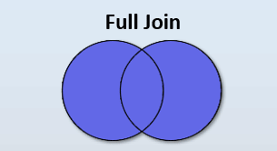

# Full Outer Join

```info
Author      Ter-Petrosyan Hakob
```

---

In `SQL`, **FULL OUTER JOIN** is the combination of what we would have if we put together the `right join` and the `left join`. 

> A **FULL OUTER JOIN** returns all rows from both tables, matching rows where possible and filling **NULL** where there’s no match.

We will create a safe demo table of goods to illustrate unmatched rows:

```sql
-- Demo table to allow "orphan goods"
CREATE TABLE goods_demo (
    id SERIAL PRIMARY KEY,
    name VARCHAR(100) NOT NULL,
    category_id INTEGER,
    price NUMERIC(8,2) NOT NULL
);

INSERT INTO goods_demo (name, category_id, price) VALUES
('Smartphone', 1, 699.00),
('Gaming Laptop', 3, 1200.00),
('Business Laptop', 3, 800.00),
('Desktop PC', 2, 600.00),
('Refrigerator', 5, 500.00),
('Blender', 5, 80.00),
('Microwave', 5, 150.00),
('Mystery Item', 999, 10.00); -- category_id does not exist
```

 If we wanted to have the left and right joins between the `goods` and `categories` tables, 
 we’d have to use the `full outer join` and write the following:


 ```sql

 SELECT
    c.id        AS category_id,
    c.name      AS category_name,
    g.id        AS good_id,
    g.name      AS good_name
FROM categories AS c
FULL OUTER JOIN goods_demo AS g ON g.category_id = c.id;


 category_id | category_name | good_id |    good_name    
-------------+---------------+---------+-----------------
           1 | Electronics   |       1 | Smartphone
           3 | Laptops       |       2 | Gaming Laptop
           3 | Laptops       |       3 | Business Laptop
           2 | Computers     |       4 | Desktop PC
           5 | Kitchen       |       5 | Refrigerator
           5 | Kitchen       |       6 | Blender
           5 | Kitchen       |       7 | Microwave
        <null|<null>         |       8 | Mystery Item
           4 | Home          |  <null> | <null>
(8 rows)

```

This diagram illustrates how the full outer join works:

<p align="center">
    
</p>


One question we need to consider is, What is the difference between a `full join` and a `cross join`? 
Well, a `full outer join` is different from a `cross join` because a `cross join` makes a `Cartesian product` from all the records present in the tables.

For example, in a cross join with the same data as the preceding full join, we would get the following result:

```sql
SELECT
    c.id        AS category_id,
    c.name      AS category_name,
    g.id        AS good_id,
    g.name      AS good_name
FROM categories AS c
CROSS JOIN goods AS g;


 category_id | category_name | good_id |    good_name    
-------------+---------------+---------+-----------------
           1 | Electronics   |       1 | Smartphone
           1 | Electronics   |       2 | Gaming Laptop
           1 | Electronics   |       3 | Business Laptop
           1 | Electronics   |       4 | Desktop PC
           1 | Electronics   |       5 | Refrigerator
           1 | Electronics   |       6 | Blender
           1 | Electronics   |       7 | Microwave
           2 | Computers     |       1 | Smartphone
           2 | Computers     |       2 | Gaming Laptop
           2 | Computers     |       3 | Business Laptop
           2 | Computers     |       4 | Desktop PC
           2 | Computers     |       5 | Refrigerator
           2 | Computers     |       6 | Blender
           2 | Computers     |       7 | Microwave
           3 | Laptops       |       1 | Smartphone
           3 | Laptops       |       2 | Gaming Laptop
           3 | Laptops       |       3 | Business Laptop
           3 | Laptops       |       4 | Desktop PC
           3 | Laptops       |       5 | Refrigerator
           3 | Laptops       |       6 | Blender
           3 | Laptops       |       7 | Microwave
           4 | Home          |       1 | Smartphone
           4 | Home          |       2 | Gaming Laptop
           4 | Home          |       3 | Business Laptop
           4 | Home          |       4 | Desktop PC
           4 | Home          |       5 | Refrigerator
           4 | Home          |       6 | Blender
           4 | Home          |       7 | Microwave
           5 | Kitchen       |       1 | Smartphone
           5 | Kitchen       |       2 | Gaming Laptop
           5 | Kitchen       |       3 | Business Laptop
           5 | Kitchen       |       4 | Desktop PC
           5 | Kitchen       |       5 | Refrigerator
           5 | Kitchen       |       6 | Blender
           5 | Kitchen       |       7 | Microwave
(35 rows)

```

> A **CROSS JOIN** produces the Cartesian product of two tables (every combination of rows), 
> whereas **FULL OUTER JOIN** returns only matching rows plus unmatched rows padded with **NULL**.

--- 

- [Home](./../../README.md)
- [PostgreSql Tutorials](./../tutorials.md)
- [Introduction to Joins](./1_Introduction_to_Joins.md)
- [Cross Join](./2_cross_join.md)
- [Inner Join](./3_Inner_Join.md)
- [Left Join](./4_Left_Join.md)
- [Right Join](./5_Right_Join.md)
- [Lateral Join](./7_Lateral_Join.md)
- [Self Join](./8_self_join.md)