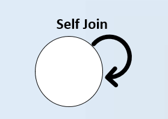

# Self Join


```info
Author      Ter-Petrosyan Hakob
```

---

A **SELF JOIN** is a regular **JOIN** where a table is joined to itself. You use table aliases so you can distinguish `“two copies”` of 
the same table—one acting as the `“left”` side and one as the `“right”` side of the join.

```sql
SELECT * from categories;

id |    name     | parent_id 
----+-------------+-----------
  1 | Electronics |    <null>
  2 | Computers   |         1
  3 | Laptops     |         2
  4 | Home        |    <null>
  5 | Kitchen     |         4
(5 rows)

```

To show each category with its parent name, join the categories table to itself:

```sql
SELECT
  child.id         AS category_id,
  child.name       AS category_name,
  parent.id        AS parent_id,
  parent.name      AS parent_name
FROM categories AS child
JOIN categories AS parent
  ON child.parent_id = parent.id;

 category_id | category_name | parent_id | parent_name 
-------------+---------------+-----------+-------------
           2 | Computers     |         1 | Electronics
           3 | Laptops       |         2 | Computers
           5 | Kitchen       |         4 | Home
(3 rows)
```

- **How It Works:**
    - **Aliases:** We refer to two logical copies of categories as child and parent.
    - **Join Condition:** `child.parent_id = parent.id` links each row in the `“child”` copy to its corresponding row in the `“parent”` copy.
    - **Result:** Only categories that have a `non‑NULL` `parent_id` appear, because **JOIN** defaults to an `inner join`.

This diagram gives us an idea of how a self join works:

<p align="center">
    
</p>


To list only the top‑level categories (those without a parent), you can use a `LEFT JOIN` and filter for `NULL` parents:

```sql
SELECT
    c.id   AS category_id,
    c.name AS category_name
FROM categories AS c
         LEFT JOIN categories AS p ON c.parent_id = p.id
WHERE p.id IS NULL;

 category_id | category_name 
-------------+---------------
           1 | Electronics
           4 | Home
(2 rows)
```

---

- [Home](./../../README.md)
- [PostgreSql Tutorials](./../tutorials.md)
- [Introduction to Joins](./1_Introduction_to_Joins.md)
- [Cross Join](./2_cross_join.md)
- [Inner Join](./3_Inner_Join.md)
- [Left Join](./4_Left_Join.md)
- [Right Join](./5_Right_Join.md)
- [Full Oouter Join](./6_Full_Oouter_Join.md)
- [Lateral Join](./7_Lateral_Join.md)