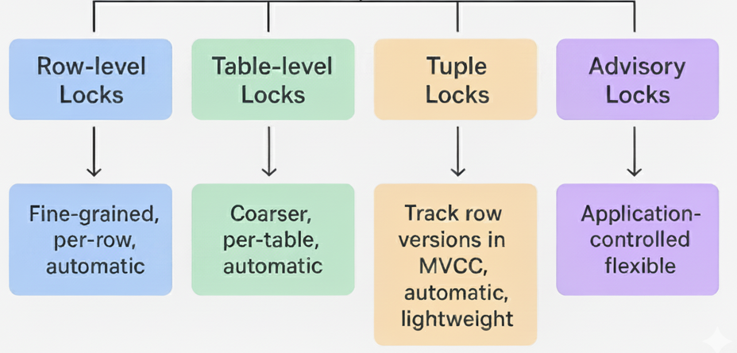

# Understanding Locks

When I first started learning about databases, I thought there were only two types of locks: `shared` and `exclusive`.

- A **shared lock** (or read lock) allows multiple sessions to read the same data at the same time.
- An **exclusive lock** (or write lock) ensures that only one session can modify data — all others must wait.

It seemed simple at first, but as I explored PostgreSQL, I realized the reality is much more nuanced. PostgreSQL provides five main categories 
of locks and over a dozen specific lock types, each serving a distinct purpose. Understanding them is crucial for writing safe and efficient applications.

Here’s an overview:

- **Row-level Locks** – Protect individual rows in a table.
- **Table-level Locks** – Protect entire tables.
- **Tuple Locks (Row Version Locks)** – Used internally by PostgreSQL’s MVCC system.
- **Advisory Locks** – Application-controlled locks, independent of MVCC.
- **Other Internal Locks** – Used internally for specific system operations (e.g., sequences, caches).

    

## Row-level Locks

Row-level locks are applied automatically during operations such as `SELECT … FOR UPDATE`, `UPDATE`, and `DELETE`. 
They protect individual rows while allowing other rows in the same table to be accessed concurrently.

| **Lock Type**       | **Description**                                                                                              |
| ------------------- | ------------------------------------------------------------------------------------------------------------ |
| `FOR UPDATE`        | Locks selected rows for update. Other transactions cannot modify them until the current transaction commits. |
| `FOR NO KEY UPDATE` | Similar to `FOR UPDATE`, but allows changing non-key columns.                                                |
| `FOR SHARE`         | Locks selected rows for reading. Other transactions can also read but cannot modify them.                    |
| `FOR KEY SHARE`     | Prevents updates or deletions to a row’s key while allowing other non-conflicting changes.                   |

**Key detail:** Row-level locks are lightweight and automatically released at the end of the transaction.

## Table-level Locks

Table-level locks control access to entire tables. They are coarser than row-level locks and are automatically acquired by certain SQL commands.

| **Lock Type**            | **Description**                                                                             |
| ------------------------ | ------------------------------------------------------------------------------------------- |
| `ACCESS SHARE`           | Acquired by `SELECT`. Allows multiple transactions to read simultaneously.                  |
| `ROW SHARE`              | Acquired by `SELECT … FOR UPDATE` or `SELECT … FOR SHARE`. Prevents schema changes.         |
| `ROW EXCLUSIVE`          | Acquired by `INSERT`, `UPDATE`, `DELETE`. May conflict with other row-exclusive operations. |
| `SHARE UPDATE EXCLUSIVE` | Rare; allows reads but prevents concurrent schema changes.                                  |
| `SHARE`                  | Acquired by `CREATE INDEX`. Blocks exclusive locks but allows reads.                        |
| `SHARE ROW EXCLUSIVE`    | More restrictive; blocks most other operations except reads.                                |
| `EXCLUSIVE`              | Blocks almost all other operations.                                                         |
| `ACCESS EXCLUSIVE`       | The most restrictive; blocks reads, writes, and schema changes.                             |

**Tip:** PostgreSQL uses a lock compatibility matrix to determine which locks conflict. Understanding this matrix is helpful for debugging deadlocks and performance issues.

## Tuple Locks (Row Version Locks)

Tuple locks protect individual row versions in PostgreSQL’s MVCC (Multi-Version Concurrency Control) system.

How it works:

- In PostgreSQL, every row can have multiple versions when updated concurrently.
- Tuple-level locks control which transaction can view or modify each version.
- These locks are automatic — you do not acquire them manually.

| **Internal Lock** | **Purpose**                                                  |
| ----------------- | ------------------------------------------------------------ |
| Key-share lock    | Prevents deletion of a tuple while allowing non-key updates. |
| Update lock       | Ensures a tuple is not modified concurrently.                |
| Exclusive lock    | Applied when a tuple is being deleted or fully updated.      |

Example scenario:

- Transaction A reads a row with `SELECT FOR UPDATE` → the tuple receives an update lock.
- Transaction B tries to update the same row → it waits until Transaction A commits.

**Key point:** Tuple locks are part of row-level locking but specifically track row versions under MVCC. They are lighter and more granular than full row locks.

## Advisory Locks

Advisory locks are user-defined and allow applications to coordinate actions across sessions. They do not interfere with MVCC row or table locks.

| **Lock Function**               | **Description**                                                       |
| ------------------------------- | --------------------------------------------------------------------- |
| `pg_advisory_lock(bigint)`      | Acquires an exclusive application-level lock on a 64-bit key.         |
| `pg_advisory_xact_lock(bigint)` | Acquires an exclusive lock released automatically at transaction end. |
| `pg_advisory_unlock(bigint)`    | Releases an exclusive advisory lock.                                  |
| `pg_try_advisory_lock(bigint)`  | Attempts to acquire the lock and returns immediately if unavailable.  |

**Note:** All advisory lock functions can alternatively take two 32-bit integers instead of a single 64-bit key. This keeps tables clean while providing flexible locking mechanisms.

## Other Internal Locks

PostgreSQL also uses internal locks to maintain system integrity, manage sequences, and protect caches.

| **Lock Type**               | **Description**                                                 |
| --------------------------- | --------------------------------------------------------------- |
| `LWLock` (Lightweight Lock) | Protects shared internal structures.                            |
| `BufferPin`                 | Prevents buffer pages from being evicted while in use.          |
| `TupleLock`                 | Protects tuple visibility in MVCC.                              |
| `Deadlock Detection Lock`   | Used internally to detect circular wait conditions (deadlocks). |

## Summary

- **Row-level locks:** fine-grained, per-row, automatic.
- **Table-level locks:** coarser, per-table, automatic.
- **Tuple locks:** track row versions in MVCC, automatic, lightweight.
- **Advisory locks:** application-controlled, flexible.
- **Internal locks:** maintain system integrity; not controlled by users.

Understanding PostgreSQL locks is essential for writing safe and high-performance applications. 
By choosing the right lock type and knowing how PostgreSQL manages concurrency, you can prevent deadlocks, 
optimize performance, and ensure data consistency.

---

- [Home](./../../README.md)
- [PostgreSql Tutorials](./../tutorials.md)
- [Table Locks](./2_Table_Locks.md)