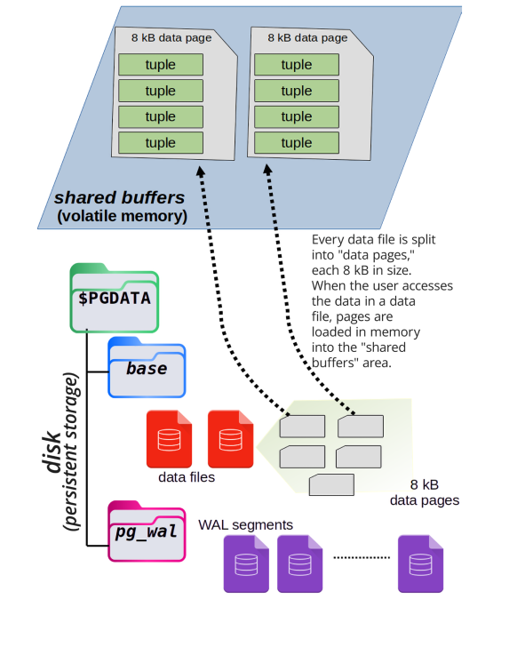
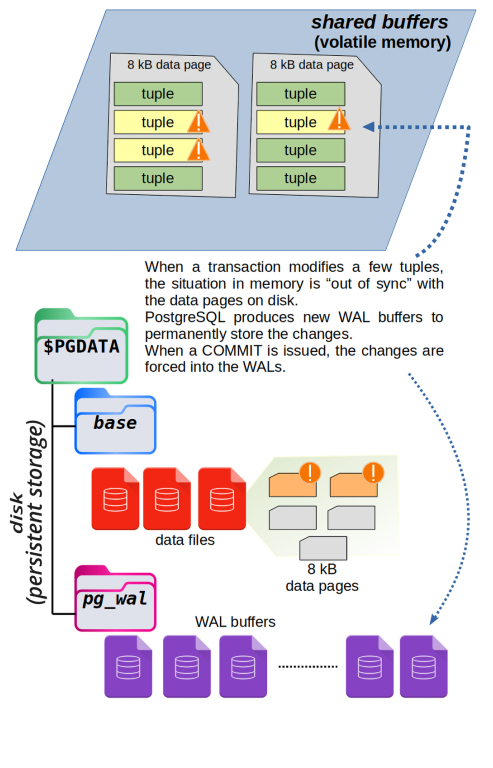
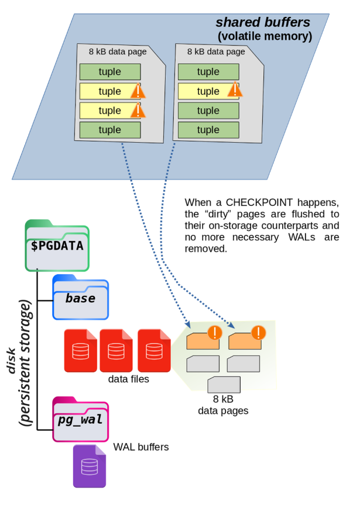
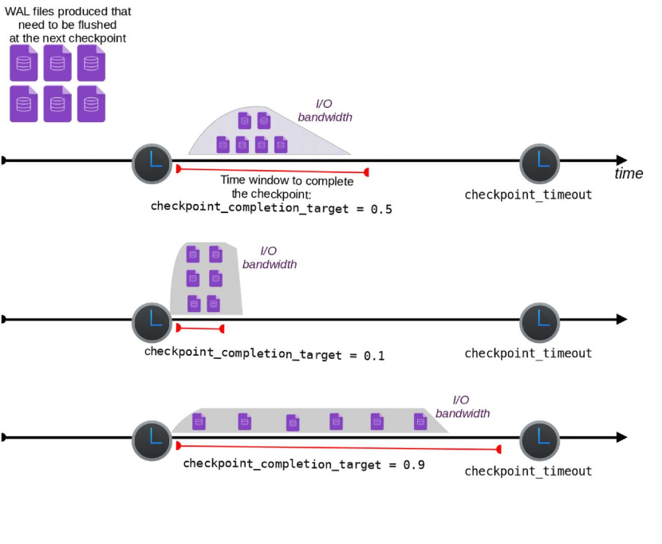

# Write-Ahead Logging (WAL)

```info
Author      Ter-Petrosyan Hakob
```
---

In the previous blog post, we looked at how PostgreSQL handles transactions—and how every SQL statement runs inside a transaction, either explicitly or implicitly.

Behind the scenes, PostgreSQL does a lot of complex work to make sure that the data stored on disk always matches the state of the committed transactions.

**In simple terms:**
Data is only considered permanent if the transaction that changed it was successfully committed.

Once a transaction is committed, PostgreSQL guarantees that its data is safe and stored, even if the database crashes or the system shuts down.
This is a key part of PostgreSQL’s reliability.

PostgreSQL uses a special system called **WAL (Write-Ahead Logging)** to manage this process.
In this blog post, we’ll explore what **WAL** is, how it works, and why it’s so important for keeping your data safe.

## WALs

Before we get into the details of **WAL**, let’s take a quick look at how PostgreSQL handles data internally.

PostgreSQL stores rows (called tuples) on disk, usually under the directory path **$PGDATA/base**.
Each table’s data is stored in a file named with just a number, not the actual table name.

When a transaction needs to access some data, PostgreSQL loads the required data pages from disk into memory—specifically into an area called shared buffers.

These shared buffers are an in-memory copy of the data stored on disk.
All transactions read and write to these shared buffers because it’s much faster than accessing the disk directly every time.

This improves performance and keeps the system efficient, even under high workloads.

The next image illustrates how data pages are loaded into shared memory from disk.

<p align="center">
    
</p>

---

When a transaction changes some data in PostgreSQL, it doesn’t write the changes directly to disk. Instead, it updates a copy of the data stored in memory, called the **shared buffers**.

At this point, the data in memory is different from what’s on disk. PostgreSQL must ensure this process is safe and reliable without slowing down performance.

The modified data in memory is marked as **dirty**, which means it has been changed but not yet saved to disk. When the transaction is committed, PostgreSQL flushes the changes to the **Write-Ahead Log (WAL)**. The dirty buffer remains in memory so other transactions can access the most recent version quickly.

Later, a background process called the [checkpointer](https://www.postgresql.org/docs/current/sql-checkpoint.html){:target="_blank" rel="noopener"} writes the dirty buffers to disk, replacing the old version. The exact time this happens doesn't matter to the transaction—what matters is that the data is safely stored in the WAL.

The diagram below shows how this works. The red buffer has been changed by a transaction and no longer matches the version on disk. When the transaction commits, the changes are flushed to the **WAL**.

<p align="center">
    
</p>

Why does PostgreSQL use **WAL** instead of immediately changing the original data on disk?

The reason is **performance**. To update a data block in the `$PGDATA/base` folder, PostgreSQL would need to find the exact spot on the disk. This requires a **random seek**, which is a slow and expensive operation.

**WAL** files work differently. They are written **in order, one after another**, like a journal. This kind of writing is much faster because it doesn't jump around the disk. It avoids slowing down the system.

By writing changes to the **WAL** first, PostgreSQL saves time and can wait to update the actual data files later—when the system is not busy and has enough disk speed available.

Each time a transaction commits, PostgreSQL saves its actions and data changes in a part of the **WAL**—specifically, 
in a section of the current **WAL** segment.

Thanks to this, PostgreSQL can replay the transaction later if needed. This helps the system recover and apply the same changes again in case something goes wrong, like a crash or power failure.

But just writing to the **WAL** is not enough to make PostgreSQL fully reliable. PostgreSQL takes extra steps to make sure that data is really saved to disk.

While writing to the **WAL**, PostgreSQL blocks interruptions from the operating system. This helps avoid problems like crashes or sudden shutdowns during the process.

After writing, PostgreSQL calls a special function called fsync. This command tells the operating system to force the data out of memory and write it to the physical disk.

PostgreSQL does all of this to make sure the changes are truly stored. However, it still has to trust the hardware. If the operating system or disk controller gives false feedback, PostgreSQL has no way to check. It must believe the report that says, “The data is saved.”

No matter what, a **COMMIT** only returns a success message to the transaction if PostgreSQL has successfully written the changes to disk. This means that if the **COMMIT** finishes without any errors, the changes have been saved in the **WAL**, and the data is considered safe.

The **WALs** are divided into smaller parts called segments. Each segment is a file that holds exactly 16 MB of changes. While it’s technically possible to change this size when setting up the database using `initdb`, it’s not recommended. So, we’ll assume every segment is 16 MB.

PostgreSQL writes changes into one **WAL** segment at a time, from start to end. Once the file reaches 16 MB, it is closed, and PostgreSQL starts a new **WAL** segment. These segment files are stored in the `pg_wal` folder inside the `$PGDATA` directory.

Each segment has a unique name that is 24 characters long, made up of hexadecimal numbers.

```
$ ls -1 $PGDATA/pg_wal
0000000700000247000000A8
0000000700000247000000A9
0000000700000247000000AA
0000000700000247000000AB
0000000700000247000000AC
0000000700000247000000AD
```

If you look inside the `pg_wal` folder, you’ll notice that each **WAL** segment has the same timeline number, for example, `7`. 
The **LSN (Log Sequence Number)** is also the same, like `247`. However, each file has a different offset, such as `A8`, `A9`, and so on.

These **WAL** segment names are not easy for humans to understand, but PostgreSQL knows exactly how to read them and where to find the right file when needed.

Over time—depending on how much memory is available and how busy the database is—PostgreSQL will take the changes from memory and write them back to their final location on disk. So, **WALs** act as a temporary but safe place to store data on disk.

This method not only improves performance (as explained earlier), but it also allows PostgreSQL to recover data if the system crashes.

## WALs as a Rescue Method in the Event of a Crash

When you shut down a PostgreSQL database properly—for example, by using the `pg_ctl` command—PostgreSQL takes the time to save all changes from memory to disk in the correct order before stopping. This is called a clean shutdown.

But sometimes, a shutdown happens unexpectedly—like during a power outage or system failure. This is called a crash.

When PostgreSQL restarts after a crash, it knows the shutdown was not clean. Some recent changes that were still in memory may not have been written to the disk. But there’s no need to worry—PostgreSQL can recover by using the **WAL**.

PostgreSQL starts a process called crash recovery. It reads the **WAL** files and uses a technique called **WAL** replay to apply the missing changes to the data on disk. This brings the database back to a consistent state, just like it was before the crash.

While crash recovery is running, the database is not available to users. But once the process is finished, PostgreSQL can safely accept connections again.

This process shows that the main purpose of **WALs** is not just to improve speed, but to help restore the database after a crash. Because **WALs** are written in order (sequentially), PostgreSQL can make data persistent with less disk work, making recovery both reliable and efficient.


### Checkpoints

At some point, PostgreSQL needs to take the changes saved in the **WAL** files and also write them to the actual data files on disk. This step is important because it makes the data fully stored and ready to use, even without the **WALs**.

These special moments are called checkpoints.

A checkpoint is a point in time when PostgreSQL makes sure that all the recent changes in the **WALs** are also written to their proper places in the data storage. This process involves more work and uses disk in a non-sequential (scattered) way, which can be slower—but it’s necessary to keep the data safe and up to date.

The diagram below shows what happens during a checkpoint.

<p align="center">
    
</p>

### Why Are Checkpoints Important?

You might wonder—why does PostgreSQL need to sync data from **WALs** to the main storage?

If this synchronization never happens, the **WAL** files will keep growing, because they are the only place where recent changes are stored. This would take up more and more space. Also, if the database crashes, PostgreSQL would need to read and replay a large number of **WALs**, which would take a long time.

Checkpoints solve this problem.

When a checkpoint happens, PostgreSQL saves all changes from the **WALs** to the correct place on disk. That way, if a crash happens later, PostgreSQL only needs to replay the **WALs** created after the last checkpoint, not all of them.

There’s another big advantage: after a checkpoint, PostgreSQL knows the older **WALs** are no longer needed, so it can reuse them for future changes. This is called **WAL** recycling. PostgreSQL simply overwrites old segments with new data instead of creating more and more files.

Because of this smart system, the amount of storage needed for **WAL** segments stays fairly constant. And if the database crashes, only a small number of **WALs**—those created since the last checkpoint—need to be replayed.

> **NOTE:**
>
> PostgreSQL can show how much **WAL** data a query generates. You can use the **EXPLAIN** command to see this information.
>
> You can also check system catalogs and logs to view details about checkpoints, and how many **WAL** segments were created or recycled.

### Checkpoint Configuration Parameters

A database administrator can adjust how and when checkpoints happen. This process is called checkpoint tuning.

Checkpoints are important for crash recovery. The more often they happen, the less time PostgreSQL needs to recover after a crash. But there’s a trade-off: frequent checkpoints use more I/O resources, which can slow down other database tasks.

When a checkpoint starts, PostgreSQL must write all dirty buffers (changed data in memory) to the disk. This can cause a sudden spike in disk activity, which might affect other running queries—especially those that need to read or write data at the same time.

That’s why it's important to carefully configure checkpoint settings based on how busy your database is. A system with heavy traffic might need a different setup than one with light activity.

PostgreSQL uses three main settings to control checkpoints. These are explained in the next sections.

#### checkpoint_timeout and max_wal_size

The timing of checkpoints in PostgreSQL can be controlled using two separate settings: `checkpoint_timeout` and `max_wal_size`.

- `max_wal_size` controls how much space the `pg_wal` folder can use. Since PostgreSQL recycles **WAL** segments at each checkpoint, 
    the folder usually stays around the same size. This setting tells PostgreSQL to trigger a checkpoint after enough data has been written to reach this size.

- `checkpoint_timeout` sets the maximum amount of time that can pass between checkpoints. If no checkpoint has happened after this time, 
    PostgreSQL will force one.

These two settings work independently—whichever limit is reached first will cause a checkpoint to start. So, a checkpoint can happen either:

- when enough data is written (because of `max_wal_size`), or
- when enough time has passed (because of `checkpoint_timeout`).

On a system with default settings, PostgreSQL will create a checkpoint every 5 minutes (`checkpoint_timeout`) or when 1 GB of **WAL** data has been written (`max_wal_size`), whichever comes first.

```sql
SHOW checkpoint_timeout;
 checkpoint_timeout 
--------------------
 5min
(1 row)

SHOW max_wal_size;
 max_wal_size 
--------------
 1GB
(1 row)

-- or you can query the pg_settings
SELECT name, setting, unit 
    FROM pg_settings 
    WHERE name IN ( 'checkpoint_timeout', 'max_wal_size' );

        name        | setting | unit 
--------------------+---------+------
 checkpoint_timeout | 300     | s
 max_wal_size       | 1024    | MB
(2 rows)    
```

After 300 seconds (5 minutes), PostgreSQL will trigger a checkpoint—unless it has already written 1,024 MB (1 GB) of **WAL** data before that.

The goal of these two settings is to make sure that there is not too much time or too many changes between two checkpoints. This helps keep the data in memory closely matched with the data saved on disk, improving safety and recovery.

**WAL** segments are filled when the database processes write transactions—like inserts, updates, or deletes. So, the `max_wal_size` setting is roughly linked to how much user data has changed in the database.

However, the amount of **WAL** data is not exactly the same as the amount of user data changed. That’s because **WAL** segments also include extra information like checksums and recovery data. Still, you can think of it as a good approximation—more changes in the database usually mean more **WAL** data.

The `max_wal_size` setting means that when PostgreSQL writes a certain amount of data changes, it will start a checkpoint. This ensures that all recent changes in memory are saved to disk.

But if the database is not very active and doesn’t reach the `max_wal_size` limit, PostgreSQL will still perform a checkpoint after a certain time—defined by `checkpoint_timeout`. This way, even low-traffic systems are safely synced at regular intervals.

By default, PostgreSQL creates a checkpoint every 5 minutes or after 1 GB of **WAL** data has been written—whichever comes first.

> **IMPORTANT:**
>
> A checkpoint only happens if something has changed since the last one. 
> If no new data has been written to the database, PostgreSQL skips the checkpoint, even 
> if the timeout has passed—because there's nothing to save.

#### Checkpoint Throttling

PostgreSQL doesn’t need to finish a checkpoint immediately. If a crash happens before the checkpoint is done, the system can still recover using **WAL** segments, starting from the last completed checkpoint.

Because of this, PostgreSQL allows you to control how fast a checkpoint should be completed using a setting called `checkpoint_completion_target`.

This setting helps spread out the work of a checkpoint to avoid a sudden spike in disk activity. You can choose a value between `0` and `1`. It tells PostgreSQL how much of the checkpoint timeout period can be used to slowly write the dirty data from memory to disk.

**Example:**

If:
- `checkpoint_timeout = 300` seconds (5 minutes)
- `checkpoint_completion_target = 0.2`

Then PostgreSQL will try to complete the checkpoint within `60` seconds (`300 × 0.2`).
The system adjusts how much disk bandwidth to use so that it finishes writing all dirty buffers within that time.

**Choosing the right value:**

- If you set `checkpoint_completion_target` closer to `0`, PostgreSQL will write everything quickly, causing high disk usage (I/O spike).
- If you set it closer to `1`, PostgreSQL will write data slowly and steadily, reducing spikes and using less disk bandwidth at once.

The diagram below shows the difference between low and high values of `checkpoint_completion_target`.

<p align="center">
    
</p>

By default, `checkpoint_completion_target` is set to `0.9`. This means PostgreSQL will try to spread the checkpoint work slowly over time. The goal is to reduce I/O spikes and avoid using too many system resources all at once.

```sql
show checkpoint_completion_target;

 checkpoint_completion_target 
------------------------------
 0.9
(1 row)
```

#### Manually Issuing a Checkpoint

A PostgreSQL administrator can manually start a checkpoint at any time by using the `CHECKPOINT` command. This starts the same process that would normally happen because of `checkpoint_timeout` or `max_wal_size`.

But why would someone want to run a checkpoint manually, since it uses system resources?

One common reason is to make sure all changes in memory are saved to disk—for example, before starting streaming replication or doing a file-level backup. In these cases, having fully up-to-date data on disk is important.

---

- [Home](./../../README.md)
- [PostgreSql Tutorials](./../tutorials.md)
- [Deadlocks](./7_Deadlocks.md)
- [VACUUM](./9_VACUUM.md)