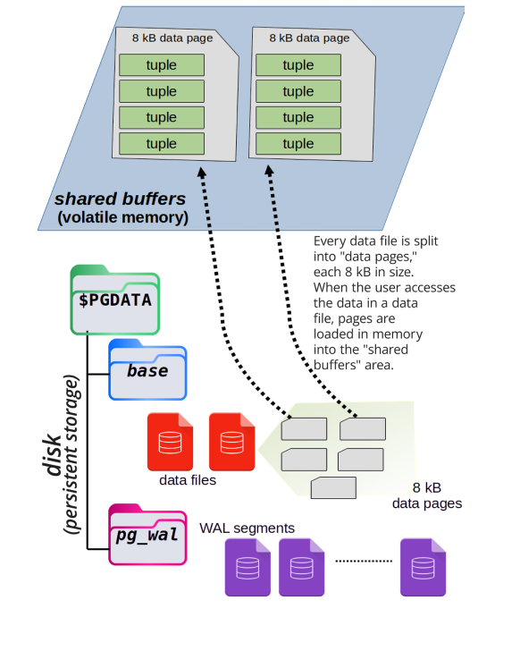
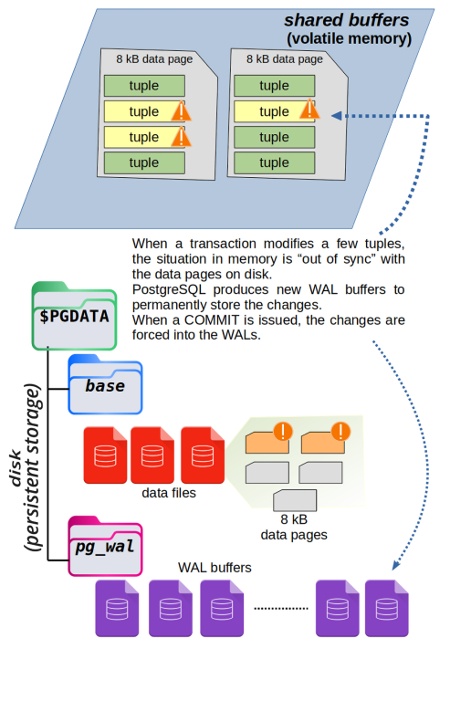

# 📜 Write-Ahead Logging (WAL)

```info
Author      Ter-Petrosyan Hakob
```
---

In the previous blog post, we looked at how PostgreSQL handles transactions—and how every SQL statement runs inside a transaction, either explicitly or implicitly.

Behind the scenes, PostgreSQL does a lot of complex work to make sure that the data stored on disk always matches the state of the committed transactions.

**In simple terms:**
Data is only considered permanent if the transaction that changed it was successfully committed.

Once a transaction is committed, PostgreSQL guarantees that its data is safe and stored, even if the database crashes or the system shuts down.
This is a key part of PostgreSQL’s reliability.

PostgreSQL uses a special system called **WAL (Write-Ahead Logging)** to manage this process.
In this blog post, we’ll explore what **WAL** is, how it works, and why it’s so important for keeping your data safe.

## WALs

Before we get into the details of **WAL**, let’s take a quick look at how PostgreSQL handles data internally.

PostgreSQL stores rows (called tuples) on disk, usually under the directory path **$PGDATA/base**.
Each table’s data is stored in a file named with just a number, not the actual table name.

When a transaction needs to access some data, PostgreSQL loads the required data pages from disk into memory—specifically into an area called shared buffers.

These shared buffers are an in-memory copy of the data stored on disk.
All transactions read and write to these shared buffers because it’s much faster than accessing the disk directly every time.

This improves performance and keeps the system efficient, even under high workloads.

📊 The next image illustrates how data pages are loaded into shared memory from disk.

<p align="center">
    
</p>

---

When a transaction changes some data in PostgreSQL, it doesn’t write the changes directly to disk. Instead, it updates a copy of the data stored in memory, called the **shared buffers**.

At this point, the data in memory is different from what’s on disk. PostgreSQL must ensure this process is safe and reliable without slowing down performance.

The modified data in memory is marked as **dirty**, which means it has been changed but not yet saved to disk. When the transaction is committed, PostgreSQL flushes the changes to the **Write-Ahead Log (WAL)**. The dirty buffer remains in memory so other transactions can access the most recent version quickly.

Later, a background process called the [checkpointer](https://www.postgresql.org/docs/current/sql-checkpoint.html){:target="_blank" rel="noopener"} writes the dirty buffers to disk, replacing the old version. The exact time this happens doesn't matter to the transaction—what matters is that the data is safely stored in the WAL.

The diagram below shows how this works. The red buffer has been changed by a transaction and no longer matches the version on disk. When the transaction commits, the changes are flushed to the **WAL**.

<p align="center">
    
</p>

## 📌 Explore More

- 🏠 [Home](./../../README.md)
- 📚 [PostgreSql Tutorials](./../tutorials.md)
- ♻️ [Deadlocks](./7_Deadlocks.md)