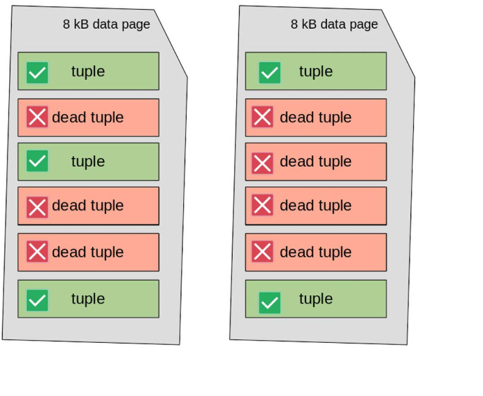

# VACUUM

```info
Author      Ter-Petrosyan Hakob
```
---

PostgreSQL uses [MVCC](./3_Multi_Version_Concurrency_Control.md){:target="_blank" rel="noopener"} to store multiple versions of the same data (called tuples) so different transactions can see the version they need. However, keeping these extra versions takes up more space on disk. Over time, if nothing is done, this unused data can fill your storage. To solve this, PostgreSQL includes a tool called **VACUUM**. Its job is to look at old tuple versions and remove the ones that are no longer needed.

>  **REMINDER:**
>
> A tuple is no longer visible (or perceivable) if no active transaction can still access it. 
> These outdated versions are called dead tuples, and they are safe to remove.

Running **VACUUM** helps clean up space, but it can also use a lot of `I/O` resources because it scans and updates storage. 
That’s why you don’t need to run it manually all the time. PostgreSQL includes a background process called **autovacuum**, which runs automatically based on how much activity your database has. This helps keep the system clean without interrupting your work.

The next sections will explain how to use both manual and automatic **VACUUM**.

## Manual VACUUM

You can run **VACUUM** manually on a single table, a set of table columns, or even an entire database. Here's the basic format:

```sql
VACUUM [ FULL ] [ FREEZE ] [ VERBOSE ] [ ANALYZE ] [ table_and_columns [, ...] ];
```

There are three main types of manual **VACUUM** operations, each one more aggressive than the last:

1) **Plain VACUUM:** This is the default. It removes dead tuples (old data no longer needed) but doesn't 
    shrink the table file on disk. So, while it helps keep things clean, it doesn’t actually free up storage space.

2) **VACUUM FULL:** This one rewrites the entire table, getting rid of both dead tuples and empty space. It reclaims real disk space 
    but is slower and more resource-intensive.

3) **VACUUM FREEZE:** This version freezes old rows that will never change again. This prevents a serious issue known as 
    XID wraparound, which can corrupt your database over time if not managed.

> **NOTE:** You cannot run **VACUUM** inside a transaction, function, or stored procedure.

You can also add:

- **VERBOSE** to show detailed output during the process
- **ANALYZE** to update table statistics, which helps PostgreSQL make better decisions when running queries

### Trying Manual VACUUM

To test **VACUUM**, first make sure **autovacuum** is turned off, so it doesn’t interfere.

Run:

```sql
SHOW autovacuum;
```

If it returns:

```sql
autovacuum  
------------  
off  
(1 row)
```

You’re ready to proceed. If not, edit your **postgresql.conf** file (found in your **$PGDATA** directory), 
set **autovacuum = off**, then restart your PostgreSQL server.

Let’s take a closer look at the categories table in our PostgreSQL database.

- **Step 1:** Check the data

    ```sql
    SELECT * FROM categories;

    id  |       name       
    ----+------------------
    1   | java
    2   | aws
    3   | javaScript
    6   | Eclipse IDE
    9   | IntelliJIdea IDE
    11  | Emacs Editor
    12  | Vi Editor
    13  | Atom Editor

    ```

- **Step 2:** Run `VACUUM ANALYZE`

    ```sql
    VACUUM ANALYZE categories;
    ```

    This command:

    - Cleans up the table (removes dead rows)
    - Updates statistics so PostgreSQL knows how many rows and pages the table uses

- **Step 3:** Check table size and metadata

    ```sql
    SELECT 
        relname, 
        reltuples, 
        relpages, 
        pg_size_pretty(pg_relation_size('categories'))
    FROM pg_class WHERE relname = 'categories' AND relkind = 'r';

    relname    | reltuples | relpages | pg_size_pretty 
    -----------+-----------+----------+----------------
    categories |        8  |        1 | 8192 bytes
    ```

    This data was selected from **pg_class**, a system catalog in PostgreSQL. It keeps track of tables, 
    indexes, sequences, and many other database objects.

    The condition `WHERE relkind = 'r'` means, only include regular tables (i.e., user-defined or system tables). 
    It excludes other object types like:
    - 'i' → indexes
    - 'S' → sequences
    - 'v' → views
    - 'm' → materialized views
    - 'c' → composite types
    - 'f' → foreign tables

    So yes—`relkind = 'r'` filters the query to only return real physical tables.


    **What Do These Columns Mean?**

    | Column               | Description                                                                |
    |----------------------|----------------------------------------------------------------------------|
    | `relname`            | The name of the table (`categories`)                                       |
    | `reltuples`          | An estimated row count — here, it's 8, which matches the actual data       |
    | `relpages`           | The number of disk pages (blocks) used — here, 1 page = 8 KB               |
    | `pg_size_pretty(...)`| The formatted size of the table — 8192 bytes = 8 KB                        |


    **This kind of query helps you:**

    - Check table size before and after running VACUUM
    - Monitor storage usage
    - Understand how PostgreSQL stores your data internally
    - Tip: You can run similar queries for other tables to keep track of space and performance in your database.

As you can see, the table currently has only 8 tuples and takes up just one data page on disk—about 8 KB in size. 
Now, let’s populate the table with around 1 million random tuples to observe how its size and structure change.

```sql
INSERT INTO categories( name ) SELECT 'GENERATED-#' || x FROM generate_series( 1, 1000000 ) x;
```

Since we have disabled **autovacuum**, PostgreSQL doesn’t automatically know the updated size of the table.

To fix this, we need to run a manual **ANALYZE** command. This updates PostgreSQL’s statistics and informs the system about the new data added to the table.

```sql
ANALYZE categories;

SELECT 
    relname, 
    reltuples, 
    relpages, 
    pg_size_pretty(pg_relation_size( 'categories' ))
FROM pg_class WHERE relname = 'categories' AND relkind = 'r';

  relname   |  reltuples   | relpages | pg_size_pretty 
------------+--------------+----------+----------------
 categories | 1.000008e+06 |     7344 | 57 MB
(1 row)

```

It is now time to invalidate all the tuples we have inserted, for example, by overwriting them with an **UPDATE** 
(which, due to [MVCC](./3_Multi_Version_Concurrency_Control.md){:target="_blank" rel="noopener"}, will duplicate the tuples)


```sql
UPDATE categories SET name = lower( name ) WHERE name LIKE 'GENERATED%';
```

The table now still has around 1 million valid tuples, but the size has almost doubled because every tuple now exists in two versions, one of which is dead:

```sql

ANALYZE categories;

SELECT 
    relname, 
    reltuples, 
    relpages, 
    pg_size_pretty(pg_relation_size( 'categories' ))
FROM pg_class WHERE relname = 'categories' AND relkind = 'r';

  relname   |  reltuples   | relpages | pg_size_pretty 
------------+--------------+----------+----------------
 categories | 1.000008e+06 |    14687 | 115 MB
(1 row)

```

We’ve now created a setup that works like a test lab for **VACUUM**. If we run a plain **VACUUM**, PostgreSQL will 
remove all the dead tuples from each data page. However, the pages themselves will not be reorganized, so the total number of pages stays the same, and the table size on disk doesn’t change.

```sql
VACUUM VERBOSE categories;


INFO:  finished vacuuming "testdb.public.categories": index scans: 1
pages: 0 removed, 14687 remain, 14687 scanned (100.00% of total)
tuples: 0 removed, 1000008 remain, 0 are dead but not yet removable
removable cutoff: 923, which was 0 XIDs old when operation ended
frozen: 0 pages from table (0.00% of total) had 0 tuples frozen
index scan needed: 7344 pages from table (50.00% of total) had 1000000 dead item identifiers removed
index "categories_pkey": pages: 5486 in total, 0 newly deleted, 0 currently deleted, 0 reusable
avg read rate: 57.588 MB/s, avg write rate: 171.774 MB/s
buffer usage: 38157 hits, 4071 misses, 12143 dirtied
WAL usage: 27497 records, 12810 full page images, 22105717 bytes
system usage: CPU: user: 0.47 s, system: 0.03 s, elapsed: 0.55 s
```

This tells us that:
- PostgreSQL found and cleaned up 1 million dead index entries (these pointed to outdated tuples).
- There are 1,000,008 active row versions in the table — no dead tuples remain.
- The table still uses 14,687 pages and is 115 MB in size — this did not shrink, because plain **VACUUM** doesn’t rewrite the table or remove empty pages.

So, while space inside the pages is now free for reuse, no actual disk space has been returned to the system.

**What’s the Purpose of Plain VACUUM?**

 Even though it doesn’t reduce the file size on disk, plain VACUUM is still very useful. It frees up 
 space inside each data page, allowing PostgreSQL to reuse that space for new inserts or updates.
 
 As a result, the table can now handle another 1 million rows without growing in size. PostgreSQL will simply 
 reuse the cleaned-up space instead of allocating new pages.


```sql

ANALYZE categories;

SELECT 
    relname, 
    reltuples, 
    relpages, 
    pg_size_pretty(pg_relation_size( 'categories' ))
FROM pg_class WHERE relname = 'categories' AND relkind = 'r';

  relname   |  reltuples   | relpages | pg_size_pretty 
------------+--------------+----------+----------------
 categories | 1.000008e+06 |    14687 | 115 MB
(1 row)


UPDATE categories SET name = upper( name ) WHERE name LIKE 'generated%';

ANALYZE categories;

SELECT 
    relname, 
    reltuples, 
    relpages, 
    pg_size_pretty(pg_relation_size( 'categories' ))
FROM pg_class WHERE relname = 'categories' AND relkind = 'r';

  relname   |  reltuples   | relpages | pg_size_pretty 
------------+--------------+----------+----------------
 categories | 1.000008e+06 |    14687 | 115 MB
(1 row)

```

As you can see, the number of tuples, pages, and table size did not change. Let’s break down what really happened:

1) We inserted 1 million rows into the table.

2) Then, we updated all of them, which—thanks to [MVCC](./3_Multi_Version_Concurrency_Control.md){:target="_blank" rel="noopener"}, will duplicate the tuples)
—created 1 million more tuples (2 million total versions).

3) We ran **VACUUM**, which cleaned up the old versions and brought the active count back to 1 million,
but the table was still taking space for 2 million rows, just with half of it empty and reusable.

4) Next, we updated the rows again, creating 1 million new versions.
This time, PostgreSQL did not need to grow the table, because it reused the internal free space from the previous cleanup—even though that space was scattered across many pages.

> **In short:** **VACUUM** didn’t shrink the file, but it recycled the storage, so PostgreSQL could keep working without using more disk space.

Unlike plain **VACUUM**, **VACUUM FULL** not only cleans up dead tuples, but it also compacts the table, physically reclaiming the freed space on disk.

If we run **VACUUM FULL** now, PostgreSQL will:

- Remove the 1 million dead tuples
- Rebuild the table, storing only the active rows
- Shrink the file size to its minimum required space


```sql
VACUUM FULL VERBOSE categories;

INFO:  vacuuming "public.categories"
INFO:  "public.categories": found 1000000 removable, 1000008 nonremovable row versions in 14687 pages
DETAIL:  0 dead row versions cannot be removed yet.
CPU: user: 0.35 s, system: 0.06 s, elapsed: 0.47 s.
VACUUM

ANALYZE categories;


SELECT 
    relname, 
    reltuples, 
    relpages, 
    pg_size_pretty(pg_relation_size( 'categories' ))
FROM pg_class WHERE relname = 'categories' AND relkind = 'r';
  relname   |  reltuples   | relpages | pg_size_pretty 
------------+--------------+----------+----------------
 categories | 1.000008e+06 |     7344 | 57 MB
(1 row)
```

The output of **VACUUM FULL** looks very similar to that of a plain **VACUUM**—you’ll still see that 1 million tuples can be removed.

But the key difference is in the result:
- **VACUUM FULL** doesn’t just clean up internal space.
- It physically rewrites the table, removing the dead space and compacting the file to the smallest size needed to hold only the active tuples
- This means the table gains back all the disk space that was previously taken by dead rows.

> **Important note:**
> While this is effective, **VACUUM FULL** is a heavy operation. It locks the table, rewrites it entirely, 
> and puts pressure on your disk (I/O system). On large, busy tables, this could cause performance issues if not scheduled carefully.

You can visualize the difference in how PostgreSQL reclaims space using simple diagrams.
Imagine a table using two data pages:

- The first page has 3 active tuples
- The second page has 2 active tuples

<p align="center">
    
</p>

Dead tuples (shown in red) cause what’s called intra-page fragmentation.
This happens when old, invisible rows are mixed between the visible (active) ones, leaving behind scattered gaps inside the data pages.

As a result, the table still occupies two full pages, even though all the valid tuples could easily fit into just one.

When you run plain VACUUM, PostgreSQL:

- Removes the dead tuples inside each page
- Compacts the valid tuples within the page
- But it does not reduce the total number of pages

So, the table will still use two pages, even though one might now be mostly empty.

> In short: **VACUUM** cleans and rearranges data inside the pages—but does not shrink the file on disk.

You can see this process in the figure below, where the dead tuples are removed, and the active ones are compacted but stay spread across both pages.

<p align="center">
    
</p>


If **VACUUM FULL** executes, the table’s data pages are fully rewritten to compact all valid tuples together. In this situation, the second page of the table results is empty and, therefore, can be discarded, freeing up storage space. The situation becomes the one depicted in the following diagram:

<p align="center">
    
</p>

## Automatic VACUUM (autovacuum)

Since version 8.4, PostgreSQL has included a background feature called **autovacuum**. This feature helps keep your database clean and fast by running 
**VACUUM** automatically.

Running **VACUUM** can be heavy on disk usage (I/O). To avoid slowing down other activities, **autovacuum** runs small clean-up jobs in the background while your database is still running normally.

In most cases, you don’t need to worry about **autovacuum**. It is turned on by default and works well in many situations. But, like many things in PostgreSQL, you can change its settings if needed. A system with good **autovacuum** settings usually doesn’t need manual **VACUUM** commands.

### How Autovacuum Works

Autovacuum works through special background processes called **autovacuum workers**. Each worker is assigned to one database. After finishing its task, it stops. PostgreSQL regularly starts new workers so that all databases and tables get cleaned up automatically.

You can control how many workers run at the same time using the **autovacuum_max_workers** setting.

Each autovacuum worker does three main things:

1) **Runs a regular VACUUM** to reduce data fragmentation and free up space.

2) Updates statistics about your data, like the **ANALYZE** command. This helps the database choose the best way to run queries.

3) **Freezes old data (tuples)** to prevent transaction ID (XID) wraparound problems, which can cause serious errors if ignored.

Even if you turn off autovacuum (not recommended), PostgreSQL may still run an emergency vacuum to avoid XID problems. In short, PostgreSQL tries to keep itself running well, even if it’s not set up perfectly.

### Autovacuum Configuration

You can view and change autovacuum settings in the `postgresql.conf` file or by querying the `pg_settings` system catalog.

Here are some key settings:


|Setting|Description|
|:------|:----------|
|autovacuum|Turns autovacuum `on` or `off`. It should almost always stay `on`.|
|autovacuum_vacuum_threshold|The minimum number of updated rows (tuples) before autovacuum runs. Default is 50.|
|autovacuum_vacuum_scale_factor|Triggers autovacuum after a certain percentage of rows are changed. Default is 0.2 (20%).|
|autovacuum_cost_limit|Sets a cost limit for how much work autovacuum can do before pausing.|
|autovacuum_cost_delay|Sets the delay time (in milliseconds) between pauses to reduce impact on other queries.|


Autovacuum checks each table. If the number of changed rows is greater than:

```
autovacuum_vacuum_threshold + (number of table rows × autovacuum_vacuum_scale_factor)
```

then **autovacuum** starts. 

While working, it keeps track of the cost. If the cost goes over **autovacuum_cost_limit**, the process pauses for **autovacuum_cost_delay** milliseconds. Then it continues. This "pause-and-resume" behavior helps reduce the impact on users and applications using the database.

## How PostgreSQL Calculates Cost

PostgreSQL uses cost values to measure how expensive an action is (like reading or writing a data page). These values apply to both manual **VACUUM** and **autovacuum**.

You can see them with this SQL query:

```sql
SELECT name, setting FROM pg_settings WHERE name LIKE 'vacuum_cost%';

          name          | setting
------------------------+---------
 vacuum_cost_delay      | 0
 vacuum_cost_limit      | 200
 vacuum_cost_page_dirty | 20
 vacuum_cost_page_hit   | 1
 vacuum_cost_page_miss  | 2

```

Manual **VACUUM** does not pause itself (because `vacuum_cost_delay` is usually 0). But autovacuum does pause, using its own `autovacuum_vacuum_cost_limit`, which defaults to 200.

There are also similar settings for the ANALYZE part:

- `autovacuum_analyze_threshold`
- `autovacuum_analyze_scale_factor`

These control when statistics are updated by the autovacuum process.

---

- [Home](./../../README.md)
- [PostgreSql Tutorials](./../tutorials.md)
- [Write-Ahead Logging (WAL)](./8_Write_Ahead_Logging.md)